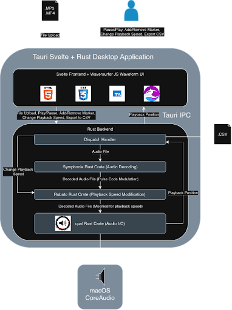

# Developer Documentation

This document is the main orientation guide for future maintainers of Audio Ninja. It explains how the codebase is organized, where to look when changing a feature, how the frontend and backend communicate, and how to diagnose common setup and runtime problems.

For step-by-step environment setup, build commands, and test commands, see:

- [Building](building.md)
- [Testing](testing.md)

## Application Overview

Audio Ninja is a desktop application built with:

- [Tauri v2](https://v2.tauri.app/) for the native desktop shell, filesystem dialogs, application bundling, and frontend-to-backend IPC.
- [SvelteKit](https://svelte.dev/docs/kit/introduction) and [Svelte 5](https://svelte.dev/docs/svelte/overview) for the frontend interface.
- [Rust](https://www.rust-lang.org/) for audio decoding/playback, marker validation, CSV import/export, audio segment export, and application state.
- [WaveSurfer.js](https://wavesurfer.xyz/) for drawing and controlling the waveform visualization in the frontend.
- [FFmpeg](https://ffmpeg.org/) as a bundled Tauri sidecar used when exporting audio segments.

At a high level:

1. The Svelte frontend renders the app and stores reactive UI state in `src/lib/state.svelte.ts`.
2. Frontend event handlers in `src/lib/actions.ts` call Rust commands through Tauri's `invoke(...)` API.
3. Rust command handlers in `src-tauri/src/commands.rs` operate on shared `AppState`.
4. Backend modules under `src-tauri/src/` perform audio playback, marker storage/validation, CSV import/export, and FFmpeg-based segment export.



Frontend state flows through Tauri into Rust services.

## Source Tree

```text
.
|-- README.md
|-- package.json
|-- package-lock.json
|-- vite.config.js
|-- svelte.config.js
|-- tsconfig.json
|-- vitest.config.ts
|-- scripts/
|-- docs/
|-- src/
|-- src-tauri/
`-- .github/workflows/
```

Generated dependency/build directories such as `node_modules/`, `build/`, `src-tauri/target/`, and coverage output are not source code. They can usually be deleted and regenerated if local builds get into a bad state.

## Frontend Structure

The frontend lives in `src/`.

### Routes

- `src/routes/+page.svelte` is the main app screen. It decides whether to show the welcome screen or the full editor, wires top-level components together, registers keyboard listeners, and starts/stops polling cleanup.
- `src/routes/+layout.ts` disables server-side rendering and enables prerendering. This matters because Tauri serves a static frontend inside a desktop webview.

### Components

- `src/components/WelcomeScreen.svelte` renders the first screen before a file is loaded.
- `src/components/Header.svelte` renders the app title, loaded file name, open/import/export buttons, and export options.
- `src/components/WaveformDisplay.svelte` owns WaveSurfer, waveform rendering, zoom controls, timeline ticks, playhead dragging, marker overlays, and marker-position editing by dragging on the waveform.
- `src/components/PlaybackControls.svelte` renders play/pause, stepping, speed controls, looping, follow-playhead, and time display.
- `src/components/MarkerPanel.svelte` renders the editable marker list, marker type selectors, marker deletion, marker splitting, marker selection, and direct timestamp editing.
- `src/components/SegmentPanel.svelte` renders validated or preview segments and allows segment title editing.
- `src/components/ShortcutsPanel.svelte` shows and edits keyboard shortcuts.
- `src/components/ErrorAlert.svelte` displays `appState.error`.
- `src/components/SuccessToast.svelte` displays `appState.successMessage`.

### Frontend Libraries

- `src/lib/state.svelte.ts` defines the singleton `appState`. Most frontend components read and update this object.
- `src/lib/actions.ts` is the main frontend behavior layer. It handles polling playback position, requestAnimationFrame interpolation, keyboard shortcuts, seeking, file opening, marker operations, segment validation, CSV import, and export commands.
- `src/lib/types.ts` defines frontend TypeScript interfaces that mirror serialized Rust data: file metadata, playback position, markers, marker kinds, and segments.
- `src/lib/shortcuts.ts` defines available shortcut actions, default bindings, shortcut matching, and display formatting.
- `src/lib/utils.ts` contains formatting and parsing helpers for timestamps, marker labels, playback speeds, and zoom levels.
- `src/lib/validation.ts` maps backend validation error messages to affected marker IDs for UI highlighting.

### Frontend Tests

- `src/tests/setup.ts` configures the frontend test environment.
- `src/tests/helpers/reset-state.ts` resets shared state between tests.
- `src/tests/unit/*.test.ts` cover actions, shortcuts, validation, utilities, imports, polling, playback, seeking, markers, and keyboard behavior.

See [Testing](testing.md) for commands.

## Backend Structure

The Tauri/Rust backend lives in `src-tauri/`.

When trying to find backend behavior, start with `src-tauri/src/lib.rs`. It lists every frontend-callable command registered with Tauri. From there, jump to the matching function in `src-tauri/src/commands.rs`, then follow that function into the audio, marker, export, or state module it uses. This is usually the fastest way to trace how a user action reaches the Rust code.

### Tauri Entry Points

- `src-tauri/src/main.rs` is the executable entry point. It calls `audio_ninja_lib::run()`.
- `src-tauri/src/lib.rs` configures the Tauri app, registers plugins, manages shared `AppState`, and registers all IPC commands with `tauri::generate_handler![...]`.
- `src-tauri/src/commands.rs` is the IPC boundary. Every function marked `#[tauri::command]` can be called from the frontend with `invoke(...)` if it is registered in `lib.rs`.
- `src-tauri/src/state.rs` defines backend application state: the active `AudioEngine` and the in-memory `MarkerStore`, both protected by `Mutex`.
- `src-tauri/src/error.rs` defines `AppError` and serializes backend errors into strings that can be shown in the frontend.

### Audio Backend

The `src-tauri/src/audio/` directory handles loading, decoding, playback, seeking, speed, looping, and audio output.

- `audio/mod.rs` exposes the audio module's public API.
- `audio/engine.rs` coordinates the decoder thread, audio output sink, playback state, control channel, metadata, and lifecycle.
- `audio/decoder.rs` probes media files with Symphonia, decodes audio frames, handles seek/control messages, and feeds samples into a ring buffer.
- `audio/output.rs` opens the system audio output through CPAL. It also defines `NullSink` for tests that should not require real audio hardware.
- `audio/control.rs` defines playback control messages and shared playback state.
- `audio/resampler.rs` handles playback-speed resampling with Rubato.

### Marker and Segment Backend

The `src-tauri/src/markers/` directory owns marker data and marker-to-segment validation.

- `markers/model.rs` defines `MarkerKind`, `Marker`, and `Segment`.
- `markers/store.rs` stores sorted markers and segment titles. Segment titles are keyed by the anchor marker: a `Start` marker or a `StartEnd` marker.
- `markers/validate.rs` converts markers into segments using a stack-based model:
  - `Start` opens a segment.
  - `End` closes the most recent open segment.
  - `StartEnd` can close the previous segment and open the next one, or create a zero-length segment if no segment is open.
  - An unmatched `End` or unmatched `Start` is a validation error.
- `markers/mod.rs` re-exports the module's public types.

### Import and Export Backend

The `src-tauri/src/export/` directory handles CSV and audio segment output.

- `export/csv.rs` formats timestamps, writes segment CSV files, parses timestamps, and imports CSV rows into segments.
- `export/segments.rs` sanitizes filenames, writes optional CSV output, and invokes the bundled FFmpeg sidecar once per exported segment.
- `export/mod.rs` exposes export helpers to the rest of the backend.

### Tauri Configuration and Assets

- `src-tauri/tauri.conf.json` controls the app name, version, bundle targets, window size, frontend build output, asset protocol, icons, and FFmpeg sidecar configuration.
- `src-tauri/Cargo.toml` defines Rust dependencies, features, and package metadata.
- `src-tauri/Cargo.lock` pins Rust dependency versions.
- `src-tauri/build.rs` is the Tauri build script entry point.
- `src-tauri/capabilities/default.json` controls Tauri permissions for the main window, including dialog and opener permissions.
- `src-tauri/icons/` contains application icons used by platform bundles.
- `src-tauri/binaries/` stores downloaded FFmpeg sidecar binaries. These are created by `scripts/download-ffmpeg.sh`.
- `src-tauri/gen/` contains generated Tauri schema files. These are generally not edited by hand.

## Project Configuration and Automation

- `package.json` defines Node dependencies and scripts for frontend dev/build/check/test, Tauri commands, coverage, and FFmpeg setup.
- `package-lock.json` pins Node dependency versions. Use `npm ci` in CI or when reproducing exact dependency installs.
- `vite.config.js` configures Vite and SvelteKit.
- `svelte.config.js` configures SvelteKit static output.
- `tsconfig.json` configures TypeScript.
- `vitest.config.ts` configures Vitest and jsdom.
- `scripts/download-ffmpeg.sh` downloads or copies platform-specific FFmpeg binaries into `src-tauri/binaries/`.
- `.github/workflows/ci.yml` runs frontend tests, FFmpeg sidecar verification, and Rust tests/checks across supported platforms.
- `.github/workflows/cd.yml` builds draft GitHub Releases for macOS `.dmg`, Windows `.msi`, and Linux `.deb` when a version tag matching `v*` is pushed.

## Frontend-to-Backend IPC Map

Frontend code calls Rust commands with `invoke('command_name', args)`. When adding or changing a command, update both sides:

1. Add or modify the Rust function in `src-tauri/src/commands.rs`.
2. Register the function in `src-tauri/src/lib.rs`.
3. Call it from `src/lib/actions.ts` or the relevant component.
4. Keep frontend types in `src/lib/types.ts` aligned with Rust serialized structs.
5. Add or update tests where possible.

Main commands currently include:

- File lifecycle: `open_file`, `open_file_dialog`
- Playback: `play`, `pause`, `seek`, `step_forward`, `step_backward`, `set_speed`, `set_loop`, `get_playback_position`
- Markers: `add_marker`, `delete_marker`, `move_marker`, `rename_segment`, `list_markers`, `validate_markers`
- Import/export: `import_csv`, `export_audio_segments`
- Shortcuts: `read_shortcuts_config`, `write_shortcuts_config`

Maintenance note: the main export UI calls `export_audio_segments`, which can export CSV, audio segments, or both. If shortcut-only CSV export is changed, make sure the frontend shortcut path and backend command registration stay aligned.

## Where to Make Common Changes

- Change visual layout or styling: start in the relevant `src/components/*.svelte` file, then check global layout styles in `src/routes/+page.svelte`.
- Change the first screen: edit `src/components/WelcomeScreen.svelte`.
- Change file open/import/export controls: edit `src/components/Header.svelte` and the matching handlers in `src/lib/actions.ts`.
- Change waveform appearance, zoom, timeline labels, playhead dragging, or marker overlays: edit `src/components/WaveformDisplay.svelte`.
- Change playback buttons, speeds, looping, follow-playhead, or time display: edit `src/components/PlaybackControls.svelte`, `src/lib/utils.ts`, and possibly backend playback commands.
- Change marker list behavior: edit `src/components/MarkerPanel.svelte`, `src/lib/actions.ts`, and marker commands in `src-tauri/src/commands.rs`.
- Change segment naming or segment preview behavior: edit `src/components/SegmentPanel.svelte`, `src/lib/actions.ts`, and `src-tauri/src/markers/store.rs`.
- Change marker validation rules: edit `src-tauri/src/markers/validate.rs` first, then update frontend validation display in `src/lib/validation.ts` if error text changes.
- Change marker or segment data shape: update `src-tauri/src/markers/model.rs`, `src/lib/types.ts`, CSV import/export code, and tests.
- Change keyboard shortcuts: edit `src/lib/shortcuts.ts` and `src/components/ShortcutsPanel.svelte`.
- Change where shortcuts are persisted: edit `read_shortcuts_config` and `write_shortcuts_config` in `src-tauri/src/commands.rs`.
- Change supported input file types: update the dialog filter in `open_file_dialog` in `src-tauri/src/commands.rs`, confirm Symphonia supports the format, and update user-facing docs.
- Change audio decoding/playback behavior: start in `src-tauri/src/audio/engine.rs`, then inspect `decoder.rs`, `output.rs`, `control.rs`, and `resampler.rs`.
- Change export filenames or FFmpeg arguments: edit `src-tauri/src/export/segments.rs`.
- Change CSV format: edit `src-tauri/src/export/csv.rs`, update import/export tests, and update user documentation if the file format changes.
- Change app name, version, bundle targets, icons, sidecars, or window defaults: edit `src-tauri/tauri.conf.json`.
- Change Tauri permissions: edit `src-tauri/capabilities/default.json`.
- Change release behavior: edit `.github/workflows/cd.yml`.
- Change CI behavior: edit `.github/workflows/ci.yml`.

## Feature Flow Reference

### Opening a File

`WelcomeScreen.svelte` or `Header.svelte` calls `openFile()` in `src/lib/actions.ts`. That invokes `open_file_dialog` in `src-tauri/src/commands.rs`. The backend opens a native dialog, constructs an `AudioEngine`, stores it in `AppState`, clears old markers, and returns file metadata to the frontend.

### Playback and Seeking

Frontend playback controls call action helpers in `src/lib/actions.ts`, which invoke playback commands in `commands.rs`. The backend delegates to `AudioEngine`. The frontend polls `get_playback_position` every 100 ms and uses requestAnimationFrame interpolation for smooth playhead movement.

### Waveform Rendering

`WaveformDisplay.svelte` creates a WaveSurfer instance when `appState.metadata.filePath` is available. It loads the file through Tauri's asset protocol using `convertFileSrc(filePath)`. The component owns pointer handling so dragging the waveform can seek or move an editing marker in real time.

### Marker Editing and Validation

Marker UI actions update frontend state and invoke marker commands. The backend keeps markers sorted in `MarkerStore`. After marker changes, the frontend calls `validate_markers`; if validation fails, it stores the error and computes partial preview segments for display.

### CSV Import

`importCsv()` in `src/lib/actions.ts` invokes `import_csv`. The backend opens a native CSV file picker, parses rows into segments, validates that imported timestamps fit inside the loaded media duration, clears existing markers, and replaces them with imported markers.

### Exporting

The header export dropdown calls `exportAudioSegments(exportCsv, exportAudio)`. The backend validates markers into segments, asks the user for an output folder, optionally writes a CSV index, and optionally calls the bundled FFmpeg sidecar to create one audio file per segment.

## Troubleshooting

### Start with a Clean Rebuild

Many confusing setup problems are stale generated files. From the project root:

```bash
rm -rf node_modules build src-tauri/target
npm install
npm run tauri -- dev
```

If you only need to refresh Node dependencies, use:

```bash
npm ci
```

### `npm install` Fails

Likely causes:

- Node is too old.
- `package-lock.json` and `package.json` are out of sync.
- Native dependencies need platform build tools.

Check:

```bash
node --version
npm --version
```

Use Node v18 or newer. If the lockfile appears inconsistent after dependency edits, regenerate it intentionally with `npm install` and commit both `package.json` and `package-lock.json`.

### `npm run check` Fails

Common causes:

- SvelteKit generated files are stale.
- TypeScript types drifted after changing Rust-returned data or frontend interfaces.
- Component props changed but parent components were not updated.

Try:

```bash
npx svelte-kit sync
npm run check
```

If errors mention a field name such as `positionMs` or `durationMs`, check both the Rust `#[serde(rename_all = "camelCase")]` structs and the TypeScript interfaces in `src/lib/types.ts`.

### `npm run tauri -- dev` Cannot Find Tauri or Vite

Make sure dependencies are installed from the project root:

```bash
npm install
npm run tauri -- dev
```

Do not run Tauri commands from inside `src-tauri/` unless you are using `cargo` directly.

### Rust Toolchain Errors

Symptoms may mention `cargo`, `rustc`, missing targets, or unsupported editions.

Check:

```bash
rustup --version
rustc --version
cargo --version
```

Then update stable Rust if needed:

```bash
rustup update stable
```

If a CI matrix target fails locally, install that target explicitly:

```bash
rustup target add <target-triple>
```

### Tauri Prerequisite Errors

Tauri depends on platform-specific native libraries and build tools.

- macOS: install Xcode Command Line Tools.
- Windows: install Microsoft Visual Studio C++ Build Tools.
- Linux: install the WebKitGTK, SSL, appindicator, SVG, and audio development packages listed in the [Tauri prerequisites](https://v2.tauri.app/start/prerequisites/) and mirrored in `.github/workflows/ci.yml`.

If Linux errors mention `webkit2gtk`, `libsoup`, `libayatana-appindicator`, `openssl`, or `xdo`, this is usually a missing system package rather than an application bug.

### FFmpeg Sidecar Errors

Errors may mention `ffmpeg sidecar not available`, `No such file`, or `failed to run sidecar`.

Try:

```bash
npm run download-ffmpeg
ls src-tauri/binaries
```

On macOS, the download script downloads a target-specific static FFmpeg binary. On Linux and Windows, it downloads from BtbN FFmpeg builds and requires tools such as `curl`, `tar`, or `unzip`.

If adding a new platform, update:

- `scripts/download-ffmpeg.sh`
- `src-tauri/tauri.conf.json`
- `.github/workflows/ci.yml`
- `.github/workflows/cd.yml`

### Audio Does Not Play

Likely causes:

- No file is loaded.
- The file format or codec cannot be decoded by Symphonia.
- The OS has no available audio output device.
- CPAL cannot open the default output device.

Check the app error message first. Backend errors are serialized from `src-tauri/src/error.rs`. For tests on machines without audio hardware, use the Rust `test-audio` feature so the backend can use `NullSink`.

### Waveform Is Blank

Likely causes:

- WaveSurfer did not receive a valid file URL.
- Tauri asset protocol access is misconfigured.
- The WaveSurfer container has zero height or width.
- The media file can play but cannot be decoded by WaveSurfer in the webview.

Check:

- `WaveformDisplay.svelte` uses `convertFileSrc(filePath)`.
- `src-tauri/tauri.conf.json` has asset protocol enabled.
- The layout in `src/routes/+page.svelte` and `WaveformDisplay.svelte` gives the waveform a real size.

### `invoke(...)` Fails with Command Not Found

The Rust command must be registered in `src-tauri/src/lib.rs`. The names must also match between the frontend string and the Rust function name.

Check:

- The function has `#[tauri::command]`.
- It appears in `tauri::generate_handler![...]`.
- The frontend uses the same snake_case command string.
- Argument names match Tauri's camelCase conversion. For example, Rust `position_ms` is called from TypeScript as `positionMs`.

### Dialogs Do Not Open

Check `src-tauri/capabilities/default.json`. The main window must have the needed dialog permissions. Also verify the app is running under Tauri, not only as a plain browser page through Vite.

### CSV Import Fails

Likely causes:

- The CSV format does not match what `src-tauri/src/export/csv.rs` expects.
- A timestamp cannot be parsed.
- An imported segment timestamp is beyond the loaded media duration.
- No media file is loaded before importing.

Look at the exact frontend error message; most CSV failures are converted to `AppError::ValidationError` or `AppError::Csv`.

### Marker Validation Fails

The backend expects marker sequences that can be paired into segments. Common errors:

- An `End` marker appears before any open `Start`.
- A `Start` marker has no later `End`.
- Marker kinds were changed in the UI but the resulting sequence is incomplete.

The frontend highlights likely problematic markers through `src/lib/validation.ts`. If validation rules or error text change, update that file too.

### Export Fails

Likely causes:

- Marker validation fails before export.
- There are no segments to export.
- The output folder cannot be written.
- FFmpeg is missing or exits with an error.
- A segment title contains filename characters that need sanitizing.

Start in `src-tauri/src/export/segments.rs`. The backend already sanitizes common invalid filename characters; if a platform still rejects a path, extend `sanitize_filename(...)`.

### GitHub Release Artifacts Are Missing

Releases are built by `.github/workflows/cd.yml` only when pushing tags that match `v*`.

Check:

- The tag was pushed to GitHub.
- The workflow completed for the platform.
- The release may be a draft release.
- macOS signing/notarization secrets are optional, but if configured incorrectly they can break signed macOS builds.
- FFmpeg sidecar download succeeded for the target platform.

### macOS Says the App Cannot Be Opened

Unsigned or unnotarized macOS builds may be blocked by Gatekeeper. For professional distribution, configure Apple Developer ID signing and notarization secrets in the GitHub repository. The CD workflow documents the required secret names.

### Windows Build Fails

Common causes:

- Visual Studio C++ Build Tools are missing.
- The Rust MSVC target is missing.
- The build is being run from a shell without required Windows build environment support.
- The FFmpeg download script needs a bash-like shell if run manually.

Follow the Windows section of the Tauri prerequisites and compare with the Windows jobs in `.github/workflows/ci.yml`.

### Linux Build Fails

Common causes:

- Missing WebKitGTK or native system libraries.
- Missing ALSA development headers.
- Missing `patchelf` for bundling.
- A target architecture mismatch.

Use the Linux dependency list in `.github/workflows/ci.yml` and `.github/workflows/cd.yml` as the most concrete reference for required packages.

## Maintenance Practices

- Keep the frontend TypeScript types and Rust serialized structs in sync.
- When adding an IPC command, update `commands.rs`, `lib.rs`, frontend actions, and tests together.
- Prefer adding tests near the logic being changed: frontend action tests for UI behavior, Rust unit tests for backend logic.
- Keep generated files out of hand edits. Edit source files, then regenerate through normal build/test commands.
- Update `README.md`, user docs, or developer docs whenever a user-visible workflow, install step, command, or supported file format changes.
- When changing bundle behavior, test both `npm run tauri dev` and `npm run tauri build`.


